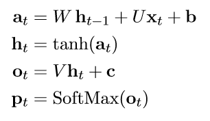
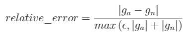
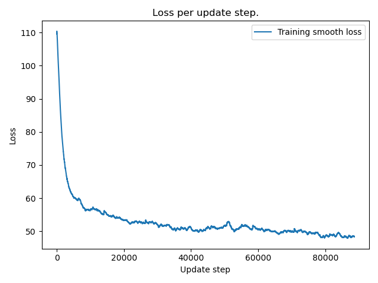

# RNN: text synthesis
Building a recurrent neural network (RNN) and using it for text synthesis

### Introduction

In this project I implemented a vanilla recurrent neural network from scratch. A network was then trained on text from a Harry Potter book, character-wise, using back-propagation through time (BPTT). The trained network was then used to synthesise text, one character at the time. 

### Implementation

The implementation can be found on [my github repo here](https://github.com/Jos3f/RNN-text-synthesis). Feel free to try it out.
 
An RNN is a neural network that utilizes previous outputs as input in the current time step. This is generally achieved through hidden states and self connections among the nodes. My implementation of the vanilla RNN consists of one layer where the previous outputs are incorporated into the calculations of the current output. The output activation function for my network is the softmax function, so that the outputs can be compared to the one hot encoded character data. The calculations made in my model can be seen in figure 1 below.  

In order to train the network weights, I have to minimize the cross-entropy loss. The gradients are calculated through BPTT. A variant of stochastic gradient decent called _AdaGrad_ (adaptive gradient) is used in my implementation to update the weights. AdaGrad is beneficial in natural languages applications because it adapts the learning rate depending on the frequency of the different data points, or in our case, the characters.

Figure 1: Calculations from input to output. Lowercase letters represent vectors and uppercase letters represent 2D matrices. xt is the one-hot encoded input for time step t and pt are the outputs used for determining the probability of the next character. W, U, b, V and c are trainable weights. b and c are bias vectors and h is the hidden state.  

To confirm that my BPTT implementation is correct, I checked my five analytically computed gradients by comparing them to numerically computed gradients. Relative error was used for this comparison. The formula for this comparison is as follows:

where ϵ = 1e-16, ga is the analytically computed gradient and gn is the numerically computed gradient (the centred difference formula with h=1e-4 was used). I tested a limited network with seq_length=25 and hidden layer node count = 5 for one forward/backward pass. The global largest relative error from each layer can be seen in table 1 (and also the average relative difference). We can see that the max relative errors are around 2e-6 or smaller for each layer, which I consider small enough for our objective. I'm confident that the gradients are correct.

Table 1: The max and average relative difference for the layers

| Weights | max                    | avg                    |
|---------|------------------------|------------------------|
| b       | 6.2144524525922746e-09 | 3.448728463025418e-09  |
| c       | 9.738042688041366e-10  | 7.067885061477302e-10  |
| U       | 5.3831050545562066e-08 | 7.637298206635687e-10  |
| W       | 1.8676573805185785e-06 | 1.9151586340226636e-07 |
| V       | 2.7168785875715193e-07 | 1.5762920663721827e-08 |
| All     | 1.8676573805185785e-06 |                        |

When generating text, I slightly modified the probability distribution of the predicted next character. Large probabilities were slightly upsampled to reduce noise when synthesising text.

### Dataset

The data set used for training was the entire book _Harry Potter and the Goblet of Fire_.

### Results

After training a network consisting of 100 hidden nodes for 100 epochs, I was able to generate some text that resembles that of the book. An example of some generated text can be seen below. The smooth loss plot can be seen in figure 2. Some generated words are not real words which is expected since this is a vanilla RNN. Vanilla RNNs are not good at remembering long term dependencies, the information from a few time steps back quickly fades away in vanilla RNNs. An LSTM or a GRU network would are better at preserving important information in temporal applications, which would show in this application. A person not proficient in English would probably have a hard time distinguishing the synthesised text from the original text. 
    

Figure 2: Smooth loss evolution for 100 epochs.

#### Example of text synthesis:

>lly in right of the Harry.  He would got and the Firt than the feam, her Chather into his fanged to rorge up and this scarted a smares into her aller of you?"
"Don't not and thinking to giving to day,

